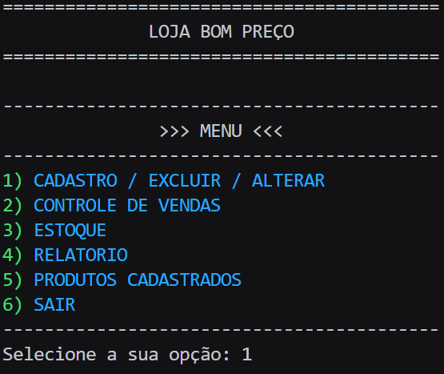
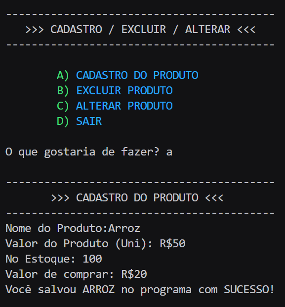

# 🧾 Sistema de Cadastro de Produtos (CRUD + Relatórios)

Um modelo de **sistema de cadastro de produtos com relatórios de estoque e de vendas**, desenvolvido em **Python**.  
O projeto tem como objetivo praticar **lógica de programação, modularização e tratamento de erros**, simulando um sistema de gestão simples de produtos.

---

## 🚀 Funcionalidades

- ✅ **Cadastro de produtos**
- 📋 **Listagem de produtos**
- ✏️ **Atualização de informações**
- ❌ **Exclusão de produtos**
- 📦 **Relatório de estoque** (quantidade disponível de cada produto)
- 💰 **Relatório de vendas** (registro e total de vendas realizadas)
- ⚙️ **Tratamento de erros** e validações de entrada
- 🧩 **Organização modular** com pacotes e funções separadas

---

## 🧠 Conceitos Aplicados

- Estruturas condicionais (`if`, `elif`, `else`)
- Estruturas de repetição (`for`, `while`)
- Modularização e uso de pacotes
- Entrada e saída de dados no terminal
- Tratamento de exceções (`try`, `except`)
- Organização de código para fácil manutenção

---

## 🏗️ Estrutura do Projeto

sistema_controle_de_produto/
│
├── main.py # Arquivo principal (ponto de entrada do programa)
│
├── sistema/
│ ├── cadastro.py # Funções de cadastro de produtos
│ ├── principal.py # Estrutura corpo do programa
│ ├── relatorio.py # Funções e Estrutura para os relatorios
│ ├── uteis # Funções auxiliares
│ ├── venda.py # Funções e Estrutura para o contrle de venda
└── README.md # Este arquivo

## 💻 Como Executar

1. Certifique-se de ter o **Python 3** instalado no seu computador.  
2. Faça o download ou clone o repositório:

https://github.com/joaovictorSsouza/sistema_controle_de_produto_python

3. Execute o progrma principal:
Python main.py

Exemplo de uso **cadastro**

🔧 Melhorias Futuras

💾 Implementar sistema de salvamento de dados.
🖥️ Criar interface gráfica.

Desenvolvido por: João Victor Azevedo de Souza
Projeto de pratica em python.
Contato: joaovictor.souzacontato@gmail.com